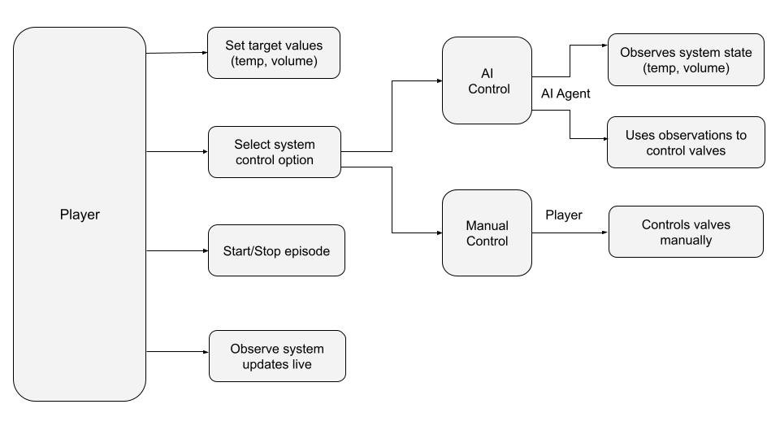

# SUSHEAT Open Prototype v1

This repository contains the source code and architecture for a simplified 3D digital twin of a water-based thermal energy system developed under the SUSHEAT project.

The prototype simulates the control of hot and cold water flows to regulate the temperature and volume in a main tank. The system operates in either **Manual** or **AI-controlled** mode.

---

## Features

- 3D Unity environment
- Manual or AI mode toggle
- Reinforcement Learning control via Unity ML-Agents
- Real-time temperature and volume simulation
- Target conditions set by the player
- Multi-tank flow: Main Tank → Requester Tank → Consumer Tank
- UI interface for real-time monitoring and manual control

---

## Control Modes

### Manual Mode
The user controls the system by pressing interface buttons to:
- Open/close valves
- Transfer or remove water
- Adjust inflow from hot or cold sources

### AI Mode
A reinforcement learning agent:
- Reads system state: tank levels, temperatures, and valve statuses
- Makes decisions about which valves to open/close
- Learns to reach target conditions efficiently

Target temperature and volume are always configurable by the player, regardless of mode.

---

## Logical Architecture

This diagram explains how the control logic is structured between the player, control modes, and system components:

---

## Data Structure

The following table outlines the parameter structure used in the system:

| Component       | Parameter              | Type     | Unit | Example | Description                                  |
|----------------|------------------------|----------|------|---------|----------------------------------------------|
| Hot Source     | `hotWaterTemp`         | Input    | °C   | 60      | Current hot water temperature                |
|                | `hotFlowRate`          | Output   | l/s  | 3.5     | Hot water flow rate to main tank             |
|                | `hotValveOpen`         | Status   | -    | True    | Valve state for hot water                    |
| Cold Source    | `coldWaterTemp`        | Input    | °C   | 20      | Current cold water temperature               |
|                | `coldFlowRate`         | Output   | l/s  | 3.5     | Cold water flow rate to main tank            |
|                | `coldValveOpen`        | Status   | -    | True    | Valve state for cold water                   |
| Main Tank      | `tankTargetTemp`       | Setpoint | °C   | 50      | Desired temperature                          |
|                | `tankCurrentTemp`      | Measured | °C   | 48      | Current temperature                          |
|                | `tankCurrentVolume`    | Measured | l    | 30      | Current fluid volume                         |
|                | `tankTargetVolume`     | Setpoint | l    | 40      | Desired volume                               |
|                | `tankCapacity`         | Limit    | l    | 100     | Maximum tank capacity                        |
|                | `overflowRate`         | Output   | l/s  | 1.0     | Overflow flow rate                           |
|                | `overflowValveOpen`    | Status   | -    | True    | Overflow valve state                         |
| Requester Tank | `requesterCapacity`    | Limit    | l    | 30      | Requester tank capacity                      |
|                | `requesterCurrentVol`  | Measured | l    | 15      | Current requester volume                     |
|                | `requesterTargetVol`   | Setpoint | l    | 20      | Target volume for requester                  |
|                | `valve_requester`      | Status   | -    | True    | Valve state to requester                     |
|                | `requester_rate`       | Output   | l/s  | 2.0     | Flow rate to requester                       |
| Consumer Tank  | `consumerCapacity`     | Limit    | l    | 25      | Consumer tank capacity                       |
|                | `consumerCurrentVol`   | Measured | l    | 10      | Current consumer volume                      |
|                | `consumerTargetVol`    | Setpoint | l    | 15      | Target consumer volume                       |
|                | `valve_usage`          | Status   | -    | False   | Valve to consumer                            |
|                | `usage_rate`           | Output   | l/s  | 1.2     | Water usage rate                             |
| System         | `isAIControl`          | Status   | -    | True    | Control mode: AI or Manual                   |

---

## Files

- `Script/Prototypev1.cs`: Main Unity agent script
- `Diagram.png`: Logical control diagram
- `README.md`: Project documentation

---

## Usage

1. Clone this repo:
git clone https://github.com/wiz-repo-github/susheat-open-prototype-v1.git

2. Open a Unity 3D project.

3. Attach `Prototypev1.cs` to a Unity GameObject.

4. Use the control UI to set the mode and target values.

5. Start training or manual interaction.

For AI training : 

Unity 2021.3 LTS or newer

ML-Agents Toolkit (v2.0 or higher)

Anaconda (for managing the training environment)

Python 3.8+

ML-Agents

